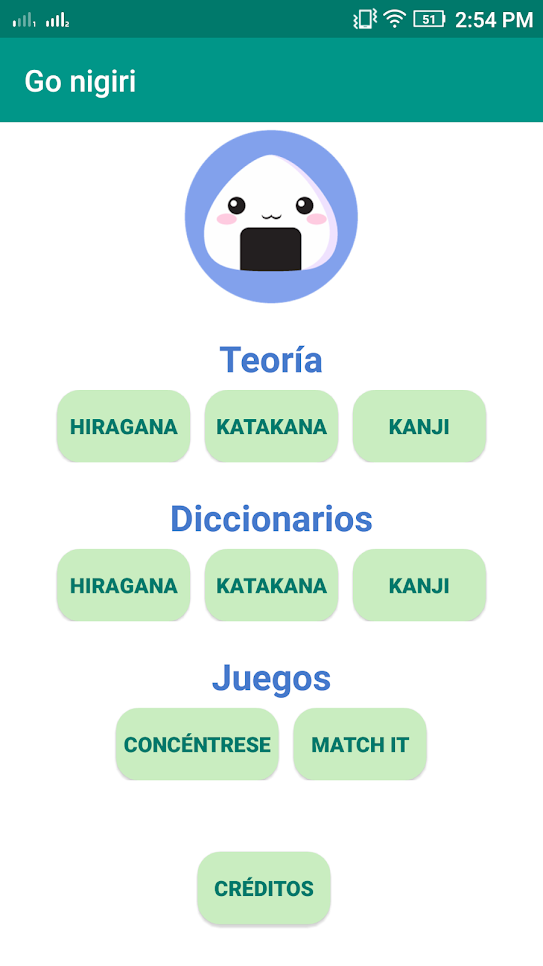
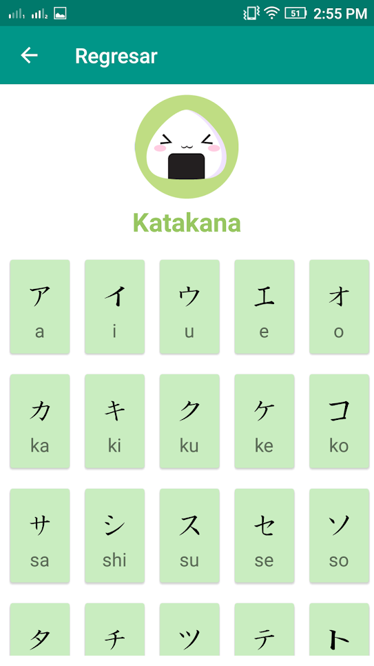
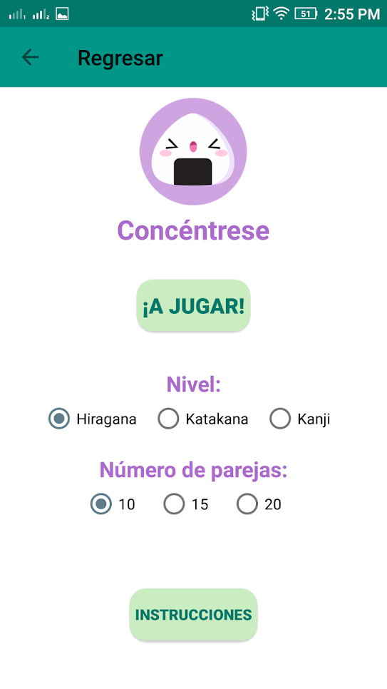
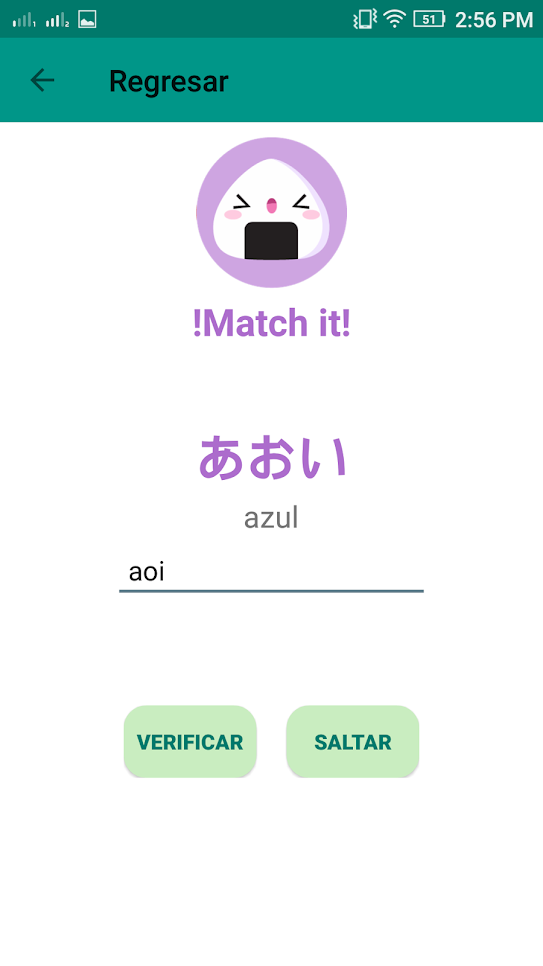
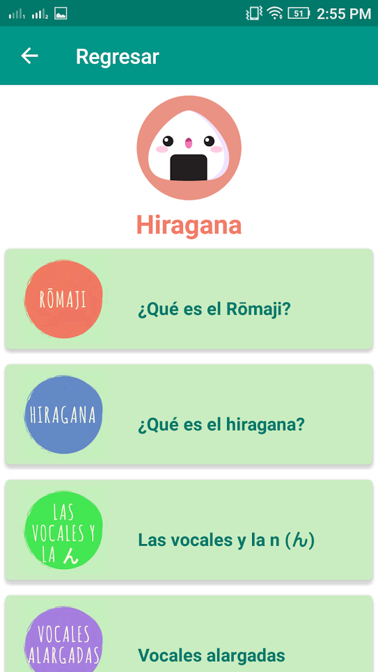

# go-nigiri

Android app for Spanish speakers to learn Japanese with games

### My work

I wrote the two games ('Match it!' and 'Concentrese', which is a memory game where you have to match the romaji with the kanas) using the native Android's Java.
I also formatted the images of the kanas using imagemagick (the images where taken from public resource and the reference is inside the credits sections of the app itself).

### Screenshots

